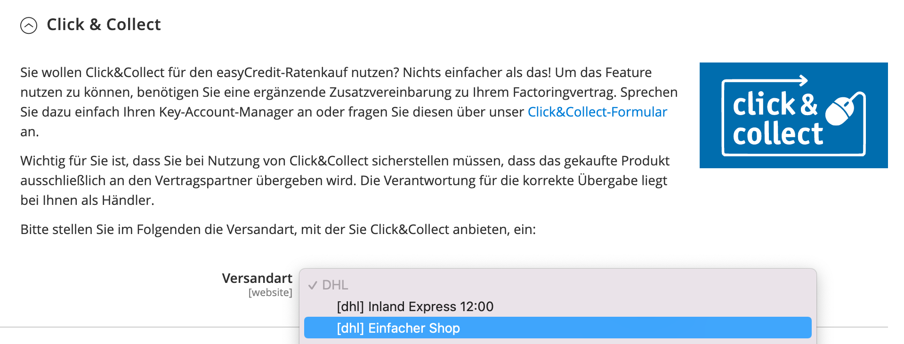

.. _configuration:

============= 
Konfiguration 
=============

Die Konfiguration des Modules befindet sich unter :menuselection:`Shops --> Konfiguration --> Verkäufe --> Zahlungsarten --> easyCredit`.

API-Zugangsdaten konfigurieren
--------------------------------------------

* Aktivieren Sie die Zahlungsart.
* Tragen Sie die Zugangsdaten in die dafür vorgesehenen Felder Webshop-ID und API-Passwort ein.
* Testen Sie die Zugangsdaten mit Klick auf **Zugangsdaten testen**.
* Nach dem erfolgreichen Test klicken Sie auf **Speichern**

.. image:: ./_static/config-open.png
           :scale: 25%

Widget konfigurieren
--------------------

Um easyCredit bei Ihren Kunden zu bewerben, blendet die Extension ein Widget auf der Produktdetailseite ein.
Dies kann über die Option "Zeige Modellrechner-Widget neben Produktpreis" gesteuert werden. Ist die Option aktiviert, wird das Widget unterhalb des Preises angezeigt. Ein Beispiel sehen Sie im folgenden Screenshot:

Click & Collect konfigurieren
------------------------------

Um *Click & Collect* für eine Versandart zu aktivieren, kann diese als *Click & Collect*-Versandart ausgewählt werden. Wählt der Kunde diese Versandart im Bezahlvorgang aus, wird dies bei der Finanzierungsanfrage entsprechend übertragen. Weitere Informationen finden Sie unter `Click & Collect <https://www.easycredit-ratenkauf.de/click-und-collect/>`_

