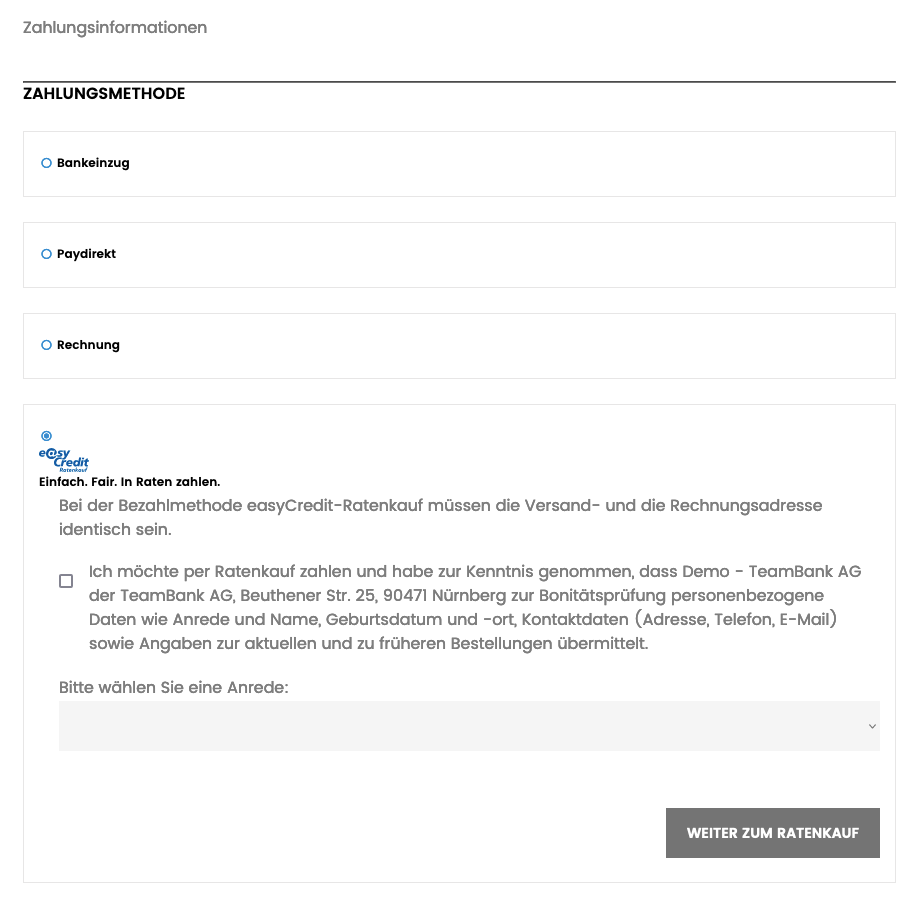

======================
Verwendung für Kunden
======================

Voraussetzungen für die Zahlung
---------------------------------

Eine Zahlung über easyCredit ist unter den folgenden Bedingungen möglich:

* es handelt sich um eine Privatperson
* die Rechnungs- und Lieferadresse des Kunden sind identisch
* die Adresse befindet sich in Deutschland
* der Bestellwert befindet sich innerhalb des von easyCredit angebotenen Finanzierungsrahmens (derzeit: 200 bis 10.000 EUR)

Bestellvorgang
--------------

easyCredit wird als Zahlungsmethode im Bezahlvorgang angezeigt. Nach Bestätigung der Zustimmungserklärung und Auswahl der Anrede wird der Nutzer auf das Zahlungsterminal von easyCredit weitergeleitet. Die Anrede muss nur ausgewählt werden, wenn diese nicht bereits bei der Adresseingabe abgefragt wurde und somit zur Verfügung steht.

.. note:: Vor Bestätigung der Zustimmungserklärung und Weiterleitung auf das Zahlungsterminal werden keine persönlichen Daten des Kunden an easyCredit weitergegeben.

Überprüfung der Bestellung
--------------------------

Nach Rückleitung vom Zahlungsterminal gelangt der Nutzer auf eine Bestätigungsseite (/easycredit/checkout/review) auf der er seine gesamte Bestellung nochmal überprüfen kann. Hier werden ihm inbesondere der aktualisierte Gesamtbetrag und die anfallenden Zinsen transparent angezeigt. Auch hat er nochmal einen Überblick über die gewählten Raten. Nach Bestätigung der Bestellung erhält der Kunde die vom System erstellte Bestellbestätigungsemail (sofern eingestellt).

