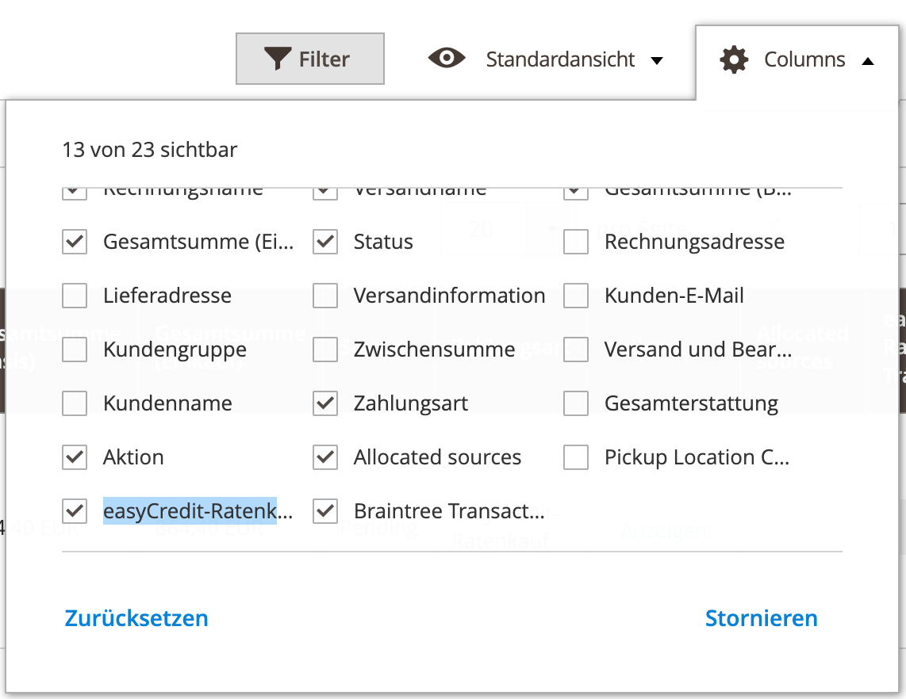
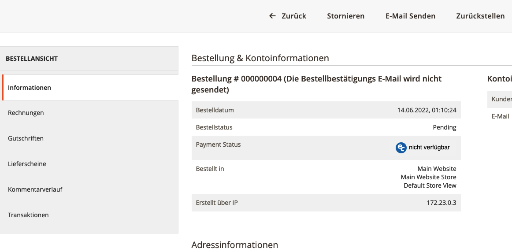

======================
Verwendung für Händler
======================

Eine neue Bestellung eines Kunde ist nach ihrem Eingang im Magento gegenüber easyCredit genehmigt ("Authorized" [#f1]_). Das heisst, die Zahlung und Bestellung wurde von easyCredit gegenüber dem Kunden bestätigt. Eine Auszahlung durch easyCredit an den Händler erfolgt erst, wenn der Händler die Lieferung der bestellten Artikel gemeldet hat. Dies erfolgt in Magento 2 entweder durch eine Bestätigung über die Transaktionsverwaltung oder durch Erstellung der Rechnung und Einziehen der Zahlung ("Capture" [#f1]_).

Alternativ ist die weitere Verwaltung des Transaktionsstatus über das `Händler-Interface <https://partner.easycredit-ratenkauf.de/portal/>`_ möglich.

Transaktionsmanager
-------------------

Der Transaktionsmanager in der Detailansicht einer mit easyCredit bezahlten Bestellung zeigt eine Übersicht über die zur Bestellung gehörende Zahlungstransaktion und deren Historie. Über den Transaktionsmanager kann der Transaktionsstatus aus dem Magento Backend heraus direkt an easyCredit gemeldet werden.

Statusmeldung über den Transaktionsmanager
~~~~~~~~~~~~~~~~~~~~~~~~~~~~~~~~~~~~~~~~~~~~~~~~

Zur Meldung des Transaktionsstatus wählen Sie den gewünschten Status und senden Sie das Formular ab. Der Transaktionsmanager aktualisiert nach Absenden die Historie und die Transaktionsdetails oberhalb.

Bei Rückabwicklung wählen Sie bitte den Grund und geben Sie bei einer Teil-Rückabwicklung den entsprechenden Betrag ein.

Statusmeldung über die Bestellverarbeitung
----------------------------------------------------

Neben der expliziten Meldung über den :ref:`Transaktionsmanager` integriert die Extension die Statusmeldung auch in die Bestellverarbeitung von Magento. Bei der Erstellung von Rechnung und Gutschrift meldet das Plugin den Status implizit.

Rechnungserstellung
~~~~~~~~~~~~~~~~~~~~~~~~~~~~~~~~~~~~~~~~~~~~~~~~

Wird eine Rechnung über Magento erstellt, wird die Transaktion bei der Rechnungserstellung eingezogen ("Capture"). Dabei wird die Lieferung automatisch an easyCredit gemeldet. Die Änderung ist im Transaktionsmanager und im Transaktionsstatus-Widget ersichtlich. 

.. note:: Die Meldung entspricht dem Status "Lieferung melden" über den Transaktionsmanager.

Gutschrifterstellung
~~~~~~~~~~~~~~~~~~~~~~~~~~~~~~~~~~~~~~~~~~~~~~~~

Wird eine Rechnung über Magento gutgeschrieben, wird die Transaktion widerrufen bzw. rückgängig gemacht und an easyCredit gemeldet ("Refund" [#f1]_). Die Änderung ist im Transaktionsmanager und im Transaktionsstatus-Widget ersichtlich. 

Die Erstattung muss über den Button "Erstatten" erfolgen. Bei einer "Erstattung (offline)" wird der Transaktionsstatus bei easyCredit nicht aktualisiert. Dies kann aber über den :ref:`Transaktionsmanager` nachgeholt werden.

.. note:: Die Meldung entspricht dem Status "Widerruf vollständig" über den Transaktionsmanager.

Anzeige des Transaktionsstatus
--------------------------------------

Der Transaktionsstatus kann einen der folgenden Werte annehmen:

* Wartend: die Transaktion ist noch nicht verfügbar. Es kann bis zu einem Tag dauern bis die Transaktion verfügbar ist.
* Lieferung melden: Die Transaktion ist vorhanden. Die Lieferung kann gemeldet werden.
* In Abrechnung: Die Lieferung wurde gemeldet. Die Auszahlung an den Händler wird bearbeitet.
* Abgerechnet: Die Auszahlung an den Händler ist erfolgt.
* Rückerstattet: Die Transaktion wurde widerrufen.

Status-Widget in Bestellübersicht
~~~~~~~~~~~~~~~~~~~~~~~~~~~~~~~~~~~~~~~

In der Bestellübersicht kann der Transaktionsstatus eingeblendet werden. Wählen Sie hierzu in der Bestellübersicht "Spalten" und setzen Sie einen Haken bei "easyCredit Transaktionsstatus".

Status-Widget in der Detailansicht
~~~~~~~~~~~~~~~~~~~~~~~~~~~~~~~~~~~~

Der Transaktionsstatus ist nochmals unterhalb des Bestellstatus in der Detailansicht ersichtlich.

.. [#f1] Es handelt sich hierbei um Magento Terminologie, die aus dem Kreditkartenbereich entstammt.
